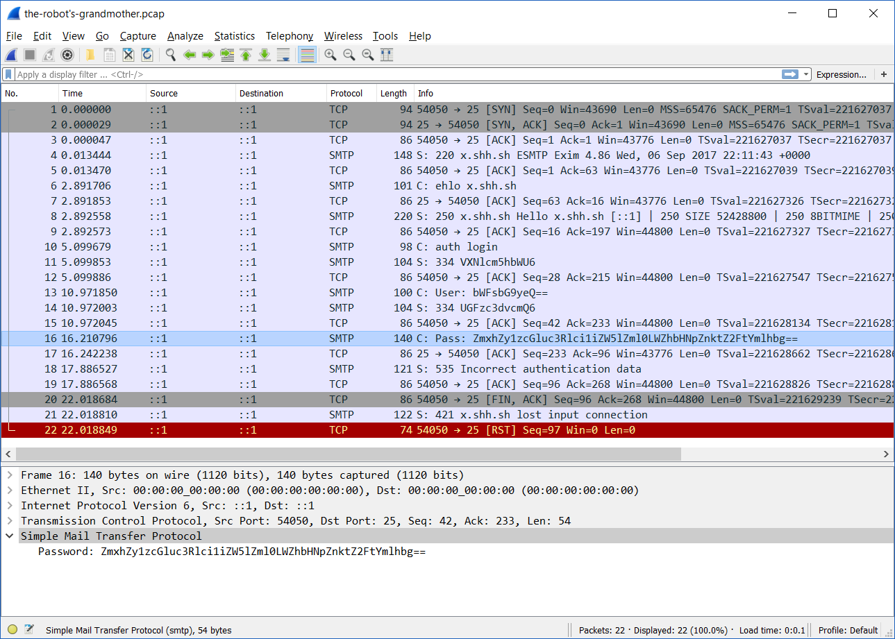

# The Robot's Grandmother (50 points, Forensics)
Robots have grandparents too!

> Every once in a while we see the Grand Robot Leader Extraordinaire communicating over 
> email with the Grand Robot Matriarch. We suspect there might be secret communications 
> between the two, so we tapped into the network links at the Matriarch's house to see if
> we could grab the password to the account. We got this file, but our network admin is 
> gone for two weeks training pigeons to carry packets. So we don't actually know how to
> read this file. Can you help us?
> 
> This challenge will be discussed at Capture the Flag: Learning to Hack for Fun and Profit at the 2017 Grace Hopper Celebration.
> 
> https://cdn.squarectf.com/challenges/the-robot's-grandmother.pcap
> 

Opening the provided .pcap file in wireshark, we find a couple of packets using the SMTP protocol.




The most interesting one being number 16, which contains a password.
```
16	16.210796	::1	::1	SMTP	140	C: Pass: ZmxhZy1zcGluc3Rlci1iZW5lZml0LWZhbHNpZnktZ2FtYmlhbg==
```

The two equal signs at the end usually means the text is Base64 encoded. Decoded,
the password is the flag for the level:

```js
> atob('ZmxhZy1zcGluc3Rlci1iZW5lZml0LWZhbHNpZnktZ2FtYmlhbg==')
"flag-spinster-benefit-falsify-gambian"
```

Flag: `flag-spinster-benefit-falsify-gambian`
